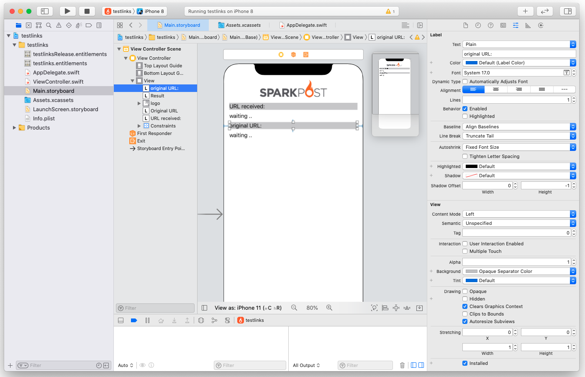
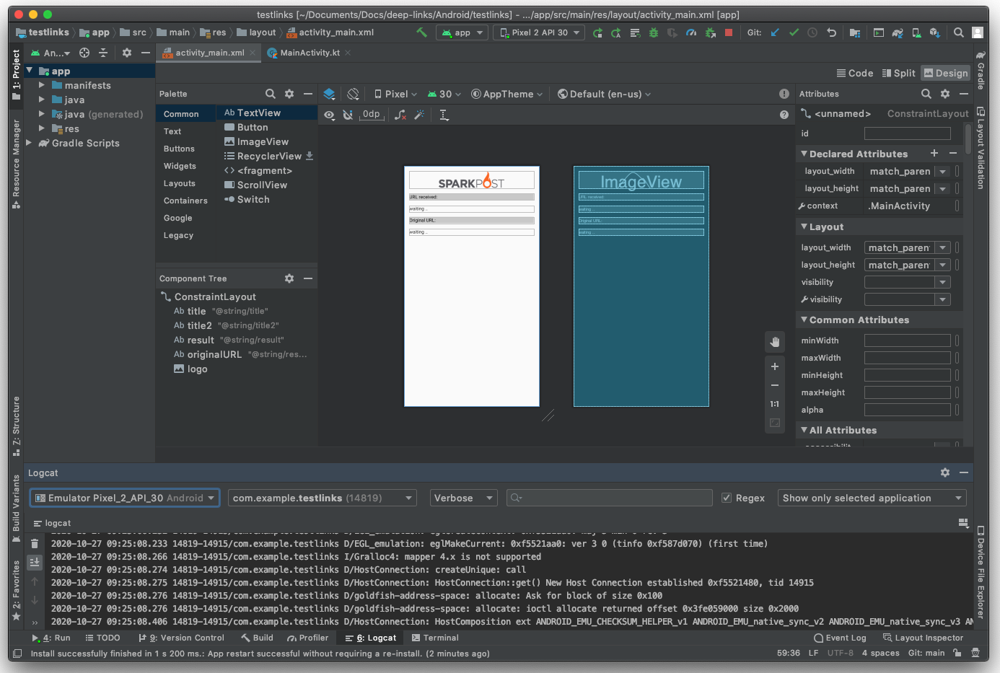

# deep-links
Example code for Deep Links / Universal Links.

For context, see [Using Mobile Universal and App Links with SparkPost](https://www.sparkpost.com/docs/tech-resources/deep-links-self-serve/).

## [iOS](./iOS)

Open the `iOS/testlinks` folder in XCode as an existing project. It should look something like this.

Configure your domains by selecting the project name in the left pane, then choose "Signing & Capabilities", then "Associated Domains", and test.

## [Android](./Android)

Open the `Android/testlinks` folder in Android Studio as an existing project.  It should look something like this.

Configure your domains in Tools / App Links Assistant, download simulators and test.